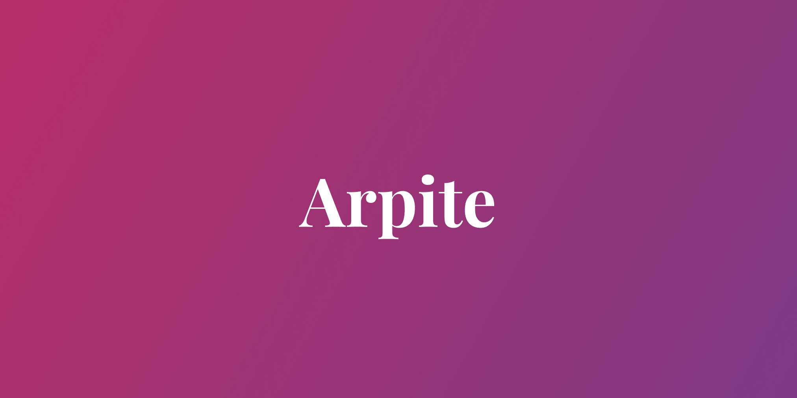

<a href="https://arpite.dev" >
  
</a>

# Arpine
An open-source Laravel library for building high-quality, accessible applications and administrator dashboards. Built using [Inertia.js](https://inertiajs.com/), [React](https://reactjs.org/), [TailwindCSS](https://tailwindcss.com/), and [React Aria](https://react-spectrum.adobe.com/react-aria/).

## Getting Started
**⚠️ Arpine is currently in early development and APIs are likely to change quite often. Use at production on your own risk!**
1. Install the packege from Composer
```bash
composer require sudobee/cygnus@dev-alpha
```

2. Publish/re-publish assets
```bash
rm -rf public/vendor/cygnus
php artisan vendor:publish --tag=cygnus-assets
```

3. Add `app.blade.php`
```html
<!DOCTYPE html>
<html lang="{{ str_replace('_', '-', app()->getLocale()) }}" class="overflow-y-scroll">
<head>
    <meta charset="utf-8">
    <meta name="viewport" content="width=device-width, initial-scale=1, maximum-scale=1.0, user-scalable=no">
    <meta name="csrf-token" content="{{ csrf_token() }}">

    <title>{{ config('app.name', 'Laravel') }}</title>

    <!-- Fonts -->
    <link rel="stylesheet" href="{{ asset('fonts/inter/inter.css') }}" />

    <link rel="stylesheet" href="/vendor/cygnus/index.css">
    <script src="/vendor/cygnus/index.js" defer></script>

    <style>
        :root {
            --cygnus-primary-50: 239 246 255;
            --cygnus-primary-100: 219 234 254;
            --cygnus-primary-200: 191 219 254;
            --cygnus-primary-300: 147 197 253;
            --cygnus-primary-400: 96 165 250;
            --cygnus-primary-500: 59 130 246;
            --cygnus-primary-600: 37 99 235;
            --cygnus-primary-700: 29 78 216;
            --cygnus-primary-800: 30 64 175;
            --cygnus-primary-900: 30 58 138;
        }
    </style>
</head>
<body class="antialiased font-base">
    @inertia
</body>
</html>
```

4. Add to AppServiceProvider boot() method
```php
Inertia::share([
    "baseUrl" => fn() => URL::to("/"),
    "applicationName" => fn() => env("APP_NAME"),
    "notification" => fn() => Notification::getAndClear(),
    "resetFormIdentifier" => fn() => Session::get(
        "resetFormIdentifier"
    ),
    "csrfToken" => fn() => csrf_token(),
]);
```

5. Add to HandleInertiaRequests share() method
```php
/** @var User|null $user */
$user = auth()->check() ? auth()->user() : null;

return array_merge(parent::share($request), [
    "user" => $user?->only("email", "name"),
    "balance" => null,
]);
```

6. Add to RouteServiceProvider getHomepage() method
```php
public static function getHomepage(): string
{
    return self::HOME;
}
```
## License
Arpite is licensed under the MIT License, see [LICENSE](./LICENSE) for more information.